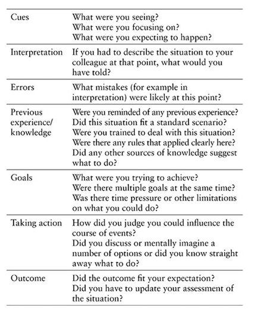

# Field Guide to Understanding 'Human Error' by Sidney Dekker

## Terms

human error, hindsight, bad apples, accountability, justice, hindsight,
safety, sharp end, blunt end, micro-matching, cherry-picking, shopping-bagging,
loss of situational awareness, risk, thematic vagabonding, cognitive fixation,
emergence, control, high-reliability organizations (HRO), Safety-I, Safety-II

## Table of contents

1. Two views of 'human error'
    * Bad people in safe systems, or well-intentioned people in imperfect
      systems?
    * People do not come to work to do a bad job
    * "Bad apples clearly exist"
    * "Accident-prone" workers
    * Individual differences exist
    * "There has to be some accountability"
    * "The authority-responsibility mismatch"
    * Accountability and the systems approach
    * New models of accountability
    * To report or not to report
    * Accountability and the "just culture"
2. Containing your reactions to failure
    * Retrospective
    * Counterfactual
    * Judgmental
    * Proximal
3. Doing a 'human error' investigation
    * Getting human factors data
    * Debriefing of participants
    * The aim of a debriefing
    * Dealing with disagreements and inconsistencies in briefings
    * Recordings, facts and analysis
    * Building a timeline
        - Two issues before you go on
        - Low-resolution communication timeline
        - Higher-resolution communication timeline
        - Conversation analysis
        - Connecting behavior and process
            * What was going on in the process at that time?
            * What other tasks would people have plausibly been involved in
              simultaneously, if at all?
        - How do you identify "events" in your data?
        - The "events" that were no events
        - Putting data in context
    * Putting data in context
        - Out of context I: micro-matching
            * a procedure or collection of rules: people not following
              procedure
            * a set of cues: people missed cues or data
            * standards of good practice that people's behavior falls short of
        - Imposing procedures onto history
        - Imposing available data onto history
        - Standrads of good practice
        - Out of context II: cherry-picking
            * grouping and labeling behavior fragments
        - Out of context III: the shopping bag
            * sweep together all evidence people should have seen
    * Leaving a trace
        - Underspecified labels
        - Operationalizing the label
    * Constructing causes
        - 'Human error' or mechanical failure?
        - The construction of cause
        - There is no "root" cause
    * Analyzing the blunt end
    * Making recommendations
        - Explanatory versus change factors
            * explanatory factors explain the data from one particular sequence
              of events
            * change factors are levers for improvement or prevention
        - Smart recommendations
            * specific
            * measurable
            * agreed (or at least agreeable)
            * realistic
            * time-bound
    * How to introduce your next 'human error' investigation
        - The aim of this 'human error' investigation
        - A word on hindsight
        - The scope of this 'human error' analysis
        - A word on time
        - A word on investigating versus learning
4. Explaining the patterns of breakdown
    * Cognitive fixation
        - Dynamic fault management
    * Plan continuation
        - Why not make a go-around?
    * Fatigue
        - workload intensitiy (or inactivity)
        - sustained effort
        - physical and psychological exertion
        - sleep depreivation or other sleep disturbances
        - time of day effects
        - circadian desynchronization
        - vigilance effects
        - cognitive slowing
        - memory effects
        - lapsing (micro-sleeps)
    * Buggy and inert knowledge
    * New technology and computerization
        - Examples
            - mode error
            - getting lost in display architectures
            - Not coordinating computer entries
            - Workload
            - Data overload
            - Not noticing changes
        - How to notice that something is not happening
        - Automation surprises
        - Speed tapes: how a cockpit knows its speed
        - More technology, higher performance expectations
    * Procedural adaptations
    * Don't use "loss of situation awareness"
        - "Loss of situation awareness" puts you outside, in hindsight
        - "Loss of situation awareness" is based on seventeenth-century
          thinking
        - "Loss of situation awareness" causes accidents and puts people in
          jail
    * Don't use "complacency"
5. Understanding your accident model
    * Chain of events
        - Please stop using the triangle
    * Barriers
    * Systems theory
    * Drift
        - Resilience and Safety I versus Safety II
6. Creating an effective safety department
    * Staff or line?
        - Escaping the passive safety-supplier trap
        - A concerned outsider who knows the inside
    * Tame your safety bureaucracy
    * Safety as responsibility down, not accountability up
    * Safety and the line organization
        - What do you do out in the field?
        - Autonomy, mastery, purpose
        - High performance teams
        - How do you motivate people to be safe when nothing has happened in a
          long time?
7. Building a safety culture
    * Influencing your culture toward the new view
    * People as a problem to control
         - Resist behavioral safety interventions
    * Safety defined as the absence of negatives
        - Question your organization's "vision zero"
        - Defining zero by its dependent variable
        - Suggesting that everything is preventable
        - Stigmatizing incidents and those involved in them
        - No support for zero vision in the safety literature
        - A blindness to real risk
        - The safety risk of low incident numbers
        - Life at the thin edge of the wedge
        - Decoy phenomena
        - Don't be overconfident in your safety management system
        - Don't just look for the holes to plug
        - What to put in those places where you see no "holes"
8. Abandoning the fallacy of a quick fix
    * Reminders for in the rubble
        - Your organization and 'human error'
        - Doing something about your 'human error' problem
        - Recognizing old view thinking
        - Creating progress on safety with the new view
    * Where to go from here
        - Examples of new view investigations
9. Epilogue: Speaking for the dead
    * Speaking for the dead, or speaking about the dead?

## Aim of a debriefing

1. Have participants tell the story from their point of view, without
   presenting them with any replays or reminders that supposedly “refresh their
   memory” but would actually distort it.
2. Tell the story back to them as investigator. This is to check whether you
   understand the story as the participants understood it.
3. If you had not done so already, identify (together with participants) the
   critical junctures in a sequence of events.
4. Progressively probe and rebuild how the world looked to people on the inside
   of the situation at each juncture. Here it is appropriate to show a re-play
   (if available) to fill the gaps that may still exist, or to show the
   difference between data that were available to people and data that were
   actually observed by them.

At each juncture in sequence events, you want to get to know:

* Which cues were observed (what did he or she notice/see or did not notice what he or she had expected to notice?)
* What knowledge was used to deal with the situation? Did participants have any experience with similar situations that was useful in dealing with this one?
* What expectations did participants have about how things were going to develop, and what options did they think they have to influence the course of events?
* How did other influences (operational or organizational) help determine how they interpreted the situation and how they would act?

Cues:

* What were you seeing?
* What were you focusing on?
* What were you expecting to happen?

Interpretation: If you had to describe the situation to your colleague at that
point, what would you have told?

Errors: What mistakes (for examples in interpretation) were likely at this
point?

Previous experience/knowledge: 

* Were you reminded of any previous experience?
* Did this situation fit a standard scenario?
* Were you trained to deal with this situation?
* Were there any rules that applied clearly here?
* Did any other sources of knowledge suggest what to do?

Goals:

* What were you trying to achieve?
* Were there multiple goals at the same time?
* Was there time pressure or other limitations on what you could do?

## Callouts

Underneath every simple, obvious story about ‘human error,’ there is a deeper, more complex story about the organization.

If it made sense for people to do what they did, then it may make sense for others as well.

The New View does not claim that people are perfect. But it keeps you from judging and blaming people for not being perfect.

Practitioners are not all exposed to the same kind and level of accident risk. This makes it impossible to compare their accident rates and say that some, because of personal characteristics, are more accident-prone than others.

A “Bad Apple” problem, to the extent that you can prove its existence, is a system problem and a system responsibility.

There is no evidence that a system approach dilutes personal accountability. In fact, second victims show just how much responsibility practitioners take for things that go wrong.

Accountability can mean letting people tell their account, their story.

The challenge is to create a culture of accountability that encourages learning. Every step toward accountability that your organization takes should serve that goal. Every step that doesn’t serve that goal should be avoided.

If you truly want to create accountability and a “just culture” in your
organization, forget buying it off the shelf. It won’t work, independent of how
much you pay for it. You need to realize that it is going to cost you in
different ways than dollars.

The more you react to failure, the less you will understand it.

Hindsight gets you to oversimplify history. You will see events as simpler, more linear, and more predictable than they once were.

Bad process may still lead to good outcomes, and vice versa.

What you believe should have happened does not explain other people’s behavior. It just makes you look ignorant and arrogant.

To understand error, take the view from the inside of the tunnel and stop saying what people failed to do or should have done.

Cause is not something you find. Cause is something you construct.
* Selective
* Exclusive (leaves things out)
* Oversimplified

What is the cause of the accident? This question is just as bizarre as asking what *the* cause is of not having an accident.

In plan continuation, early and strong cues suggest that sticking with the original plan is a good, and safe, idea. Only later, and weaker, cues suggest that abandoning the plan would be better. In hindsight, it is easy to forget to see the cues from the point of view of people at the time, and when and how strongly they appeared.

“Loss of situation awareness” is the difference between what you know now, and what other people knew back then. And then you call it their loss.

Using complacency is an investigative cop-out. Guess who is being ‘complacent’ when you use the term in your investigation!

A continued belief in the triangle can probably make your industry less safe.
It rocks you to sleep with the lullaby that the risk of major accidents or
fatalities is under control as long as you don’t show minor injuries, events or
incidents.

The barrier, or defenses-in-depth, model, is still a chain-of-events model too. One breach needs to precede the next. Also, the final link in the chain is an “unsafe act” by a frontline operator. A ‘human error’ in other words.

Is safety making sure those few things don’t go wrong, or that as many things as possible go right?

Safety has increasingly morphed from operational value into bureaucratic accountability. Those concerned with safety are more and more removed—organizationally, culturally, psychologically—from those who do safety-critcal work at the sharp end.

Having a large safety bureaucracy could actually increase the probability of an accident. A bureaucracy can produce “fantasy documents” and demand compliance with cumbersome processes while not dealing with real sources of risk.

Safety management systems can become liability management systems when their
main role is to prove that management did something about a problem (even if
that meant telling everybody else to try harder).

If all you do is look after people’s safety, they may feel treated as children. If you look after people’s work, they will likely feel treated as colleagues.

To take responsibility for safety on the line, you should first and foremost look at people’s work, more than (just) at people’s safety.

No wonder we blame “safety culture” for more and more accidents. By blaming “safety culture,” we pretty much cover everything. But it explains little.

Behavior-based safety programs focus on workers’ “unsafe acts.” They see ‘human error’ as the cause of trouble and place responsibility for safety on workers themselves.

Behavioral safety interventions typically focus on who is responsible, not on what is responsible for creating risk.

Initiatives that try to suppress the number of reported incidents see safety as an absence of negatives. These might actually harm safety in the long run.

A commitment to zero suggests that we must manipulate a dependent variable. This has got things upside-down.

At the thin edge of the wedge, holes in layers of defense and formally reported incidents are no longer the herald of accidents or fatalities. Normal work is.

How do you make ‘human error’ go away? The answer isn’t as simple as the question. A ‘human error’ problem, after all, is an organizational problem. It is at least as complex as the organization that has helped create it.

Hard fixes change something fundamental about, or in, the organization. This makes them hard. But it also makes them real fixes.

Reprimanding “Bad Apples” is like peeing in your pants. You did something about the problem and feel relieved. But then it gets cold and uncomfortable. And you look like a fool.

The Old View really has efficiency and expediency going for it. You don’t have to do a lot of analytic work, or put in the hard investigative yards. Just say where other people went wrong.

The alternative of speaking for the dead is speaking about the dead. Investigations often speak badly about the dead.

## Notes

Storytelling is a powerful mechanism for others to learn vicariously from trouble.

1. Don't ask who is responsible, ask what is responsible
2. Link knowledge of the messy details with the creation of justice
3. Explore the potential for restorative justice
4. Go from backward to forward-looking accountability
5. Put second victim support in place

Reactions to failure are typically:
* retrospective
* counterfactual
* judgmental
* proximal

The problem about taking this position of retrospective outsider is that it does not allow you to explain anything.

This means zooming out, away from looking just at the sharp end, and
incorporating blunt end policies and priorities and design choices and how
these help drive people’s goals and practices at the sharp end.

In order to understand other people’s assessments and actions, you must try to attain the perspective of the people who were there at the time.

Cause is not something you find. Cause is something you construct. How you
construct it, and from what evidence, depends on where you look, what you look
for, who you talk to, what you have seen before and likely on who you work for.

In order to push a well-defended system over the edge (or make it work safely), a large number of contributory factors are necessary and only jointly sufficient.

* **Start at the blunt end**, not the sharp end.
* Make sure, through what you find, that you identify the **organization's model(s) of risk**
* Trace the difference between **work as imagined and work as actually done**
* Allow the reader to understand **what made the difference** on the day of the
  accident.

Do not rely on ‘human error’ or “unsafe acts” to explain the difference—that is
the cheap way out. Remember that people come to work to do a good job. The way
they have learned to adapt around technical difficulties, resource constraints
and efficiency pressures, however, may not be well-suited for all conditions in
a complex, changing world.

The question is not what people should have done in order to avoid the outcome
we now know (that is, given our understanding of the situation). The question
is why people did what they did given their understanding of the situation
(which did not include the outcome).

The aim of a distal reach is to explore how aspects of training, documentation,
operational or managerial decision making, regulatory influences or industry
standards may all have influenced what people at the sharp end saw as making sense at the time.

Perhaps this investigation should be called a learning review.

The ultimate aim is to learn and imrpove.

The questions that people involved in any incident should really be getting are, “What do you guys want to do, or need, to make this better?”

Human performance issues

* cognitive fixation
* plan continuation
* fatigue
* buggy or inert knowledge
* new technology and computerization
* procedural adaptations

The account offered in a New View ‘human error’ investigation should aim for a maximally plausible explanation of why people did what they did. It should use a number of analytical and theoretical perspectives to lay out the broadest possible basis for its conclusions about what went on in that workplace at the time.

Dynamic fault management: people have to commit cognitive resources to solving
problems while maintaining process integrity.

Sticking with the original plan while a situation has actually changed and calls for a different plan is what Judith Orasanu calls “plan continuation.”

Decision making in a dynamic situation is hardly about making decisions, but rather about continually sizing up the situation.

Operational decisions are not based on a “rational” analysis of all parameters that are relevant to the decision. Instead, the decision, or rather a continual series of assessments of the situation, is focused on elements in the situation that allow the decision maker to distinguish between reasonable options.

If material is learned in neat chunks and static ways (books, most computer-based training) but needs to be applied in dynamic situations that call for novel and intricate combinations of those knowledge chunks, then inert knowledge is a risk.

New tech:

* Although first introduced as greater protection against failure (more precise
  approaches to the runway with a Head-Up-Display, for example), the new
  technology allows a system to be driven closer to its margins, eroding the
  safety advantage that was gained.
* New technology is also often ill-adapted to the way in which people do or did
  their work, or to the actual circumstances in which people have to carry out
  their work, or to other technologies that were already there.
* New technology often forces practitioners to tailor it in locally pragmatic
  ways, to make it work. They have to “finish the design” in practice.
* New technology shifts the ways in which systems break down, asking people to
  acquire more knowledge and skills, to remember new facts, settings

Such goals are typically easily measurable (for example, customer satisfaction,
on-time performance), whereas it is much more difficult to measure how much is
borrowed from safety.

Departures from routine become routine.

When you discover a gap between procedure and practice:
* Note: it is often compliance that explains people's behavior: compliance with norms
that evolved over time--not deviance.
* Find out what organizational history or pressures exist behind these routine departures from the routine;
* Understand that the rewards of departures from the routine are probably immediate and tangible
* Realize that continued absence of adverse consequences may confirm people
  in their beliefs (in their eyes justified!) that their behavior was safe,
  while also achieving other important system goals.

Any human factors investigation that does not take goal conflicts seriously,
does not take human work seriously.

The way each individual looks at the world is determined by where that
individual stands: 

* everybody’s perspective is unique, determined by the position from which you take it
* no two people can be in the exact same position at the same time, so no two perspectives can ever be the same
* nobody’s perspective on the world can be reduced to someone else’s
* everybody’s perspective is subjective
* nobody has an “objective” perspective, against which other people’s “subjective” perspectives can be
  compared.

The focus on defenses as the best investment in safety has led in many systems to greater complexity.
* The more complex a system, the more difficult it becomes to control
* The more complex a system, the more difficult it becomes for people to even
  know whether they still have adequate control or not

**Emergence**: safety is an emergent property that arises when system
components and processes interact with each other and their environment.

**Control** imposes constraints on degress of freedom of components, so as to
control their interaction.

One starting point, then, for understanding a driver behind routine deviations, is to look deeper into these goal interactions, these basic incompatibilities in what people need to strive for in their work.

High reliability organizations (HRO) deal with risk by remaining chronically uneasy.

HRO suggests you stay curious, open-minded, complexly sensitized, inviting of
doubt and ambivalent toward the past.

Chronic unease, and its basis in your understanding of actual practice,
requires leadership involvement.

Managing safety on the basis of incidents is only one way--and in a sense a
very limited way. It focuses, after all, on the few occasional times when
things go (almost) wrong, rather than on the many times that things go right.

Safety II: safety is teh presence of positive capacities, capabilities and
competencies that make things go right.

In Safety II, the focus of safety management is to ensure that as many things as possible go right. This requires safety people as well as operational managers to understand how the system succeeds under varying conditions.

An organization will also want to understand the messy details of how people
normally get their jobs done—despite the goal conflicts, design flaws,
communication difficulties and more.

What presents difficulty on a daily basis, the often-encountered workarounds
and frustrations? Such things might indeed be better predictors of system
safety and risk than your formally reported incidents.

Safety is not something that the safety department produces, so targets make little sense.

A continued grounding in operational reality.

A sensitivity to legitimate organizational concerns about production pressures and economic constraints.

Show, for example, how safety margins may have been eroding over time, and
where the gap lies between what causes problems in the operation and what
management seems to believe.

Creating safety is about giving people who do safety-critical work the room and possibility to do the right thing.

Providing them with error-tolerant and error-resistant designs, workable
procedures and the possibility to focus on the job rather than on bureaucratic
accountabilities.

* What does it take to get the job done on a daily basis? What are the
  “workarounds,” innovations or improvisations that people have to engage in in
  order to meet the various demands imposed on them?
* What are the daily “frustrations” that people encounter in getting a piece of
  machinery, or technology, or even a team of people (for example,
  contractors), to work the way they expect?
* What do your people believe is “dodgy” about the operation? Ask them that
  question directly, and you may get some surprising results.
* What do your people have to do to “finish the design” of the tools and
  technologies that the organization has given them to work with? Finishing the
  design may be obvious from little post-it notes with reminders for particular
  switches or settings, or more “advanced” jury-rigged solutions (like an
  upside-down paper coffee cup on the flap handle of the 60-million dollar jet
  I flew, so as to not forget to set the flaps under certain circumstances).
  Such finishing the design can be a marker of resilience: people adapt their
  tools and technologies to forestall or contain the risks they know about. But
  it can also be a pointer to places where your system may be more brittle than
  you think.
* How often do your people have to say to each other: “here’s how to make it
  work” when they discuss a particular technology or portion of your operation?
  What is the informal teaching and “coaching” that is going on in order to
  make that happen?

Managers are expected to manipulate a dependent variable—this is an oxymoron. Manipulating a dependent variable is something that science considers to be either impossible or unethical.

the potential for having an accdient grows as a normal by-product of doing
business under normal pressures of resource scarcity and competition. Thi shas
to do with:

* *cultures of production* where problem-solving under pressure and constraints is highly valued
* *structural secrecy* associated with bureaucratic organization, where
  information dodes not cross the boundaries of the various silos in which
  work is done and administered
* *gradual acceptance* of more risk as bad consequences are kept at bay.

The risk of having an accident is a fixed, structural property of the complexity of the systems we choose to build and operate.

The fewer incidents a construction site reported, the higher its fatality rate
was.

Carriers with higher rates of nonfatal accidents/incidents had lower mortality
risks. This supports the importance of learning from near misses.

You want to peg your investments in safety to the level of safety the particular activity has already attained.

At the thin edge of the wedge:

* That which is going to bite you—the unlikely but still possible accident—will likely be something you were not measuring
* It will likely be something that has not been reported as an incident by one of your workers.

The surprising accidents and fatalities that still occur at the thin edge of
the wedge, however, seem to be preceded not by “holes” in the layers of defense
nor by incidents that have been formally reported as risky events that
foreshadow an accident. Instead, they seem preceded by normal work, done by
normal people in what looks to everybody to be a normal organization. This will
likely include the workarounds and daily frustrations, the improvisations and
adaptations to get designs and procedures to work in practice, the slightly
unreliable results or readings from various tests (for example, end-play
measurements, negative pressure tests), the shortcuts that get taken to
accommodate production pressures.

What to put in those places where you see no "holes"

* Monitoring of safety monitoring
* Do not take past success as guarnatee of future safety
* Resist distancing through differencing
* Resist fragmented problem solving
* Knowing the gap between work-as-imagined and work-as-done
* Keeping the discussion about risk alive even when everything looks safe
* Having a person or function within the system with the authority, credibility
  and resources to go against common interpretations and decisions about safety
  and risk.
* The ability and etent of bringing in fresh perspectives

## Important lessons (summarized in chapter 8)

Five sets of reminders about:

* your own org and nature of safety & risk in it
* what to think about when investigating 'human error'
* how to recognize Old View thinking
* how to create progress on safety with the New View

Whenever you try to understand 'human error', do not forget to take the point
of view of the person inside the situation

### Your org & 'human error'

1. Your org is not basically or inherently safe. People have to create safety
   by putting tools & tech to use while negotiating multiple systems goals at
   all levels of your org.
2. The priorities & prefs that people express through their practice may be
   logical reproduction of what entire org finds important
3. Human error is inevitable by-product of pursuit of success in imperfect,
   unstable, resource-constrained world. Occasional human contribution to
   failure occurs because complex systems need an overwhelming human
   contribution for their safety.
4. So 'human error' is never at the root of your safety problems. 'Human error'
   is the effect of trouble deeper inside your system.
5. It also means that 'human error' is not random. 'Human error' is
   systematically connected to features of people's tools, tasks and operating
   environment.

### What to think of when investigating 'human error'

* As far as the people involved were concerned, the otucome was not going to
  happen. Otherwise, they would have done somethign else.
* Nobody comes to work to do a bad job.
* Human error is not the cause of failure, but the effect.
* Explaining one error (e.g., operator error) by pointing to another (e.g., deficient management) does not explain anything.
* To understand what went on in somebody's mind, you have to reconstruct the
  situation in which the mind found itself.
* There is no such thing as the cause of a mishap. What you deem causal depends
  on your accident model.

### Doing something about your 'human error' problem

* No quick fixes
* Reprimanding bad apples accomplishes nothing
* Can't expect employees to be more committed to safety than managers are or
  appear to be
* Problems result from organization's complexity
* Do not expect that you can hold people accountable for their errors if you did not give them enough authority to live up to the responsibility you expect of them.

### Recognizing old view thinking

* Old View thinking sees ‘human error’ as the major threat to basically safe
  systems. Unreliable, erratic people undermine systems of multiple defenses,
  rules, procedures and other safeguards.
* Old View thinking will try to count and categorize errors, and endeavor to
  get the number of ‘human error’ incidents down. It assumes that safety, once
  established, can be maintained by monitoring and keeping people’s performance
  within pre-specified boundaries.
* Old View thinking will (unsuccessfully) try to revert to more automation,
  tighter procedures, closer supervision and reprimands to control erratic
  human performance.
* During downsizing, budget trimming and increased production pressures, Old
  View thinking will misinterpret ‘human errors’ as a source of trouble, when
  they are likely the inevitable downstream consequences of trying to do more
  with less.

### Creating progress on safety with the new view

* To create safety, you don’t need to rid your system of ‘human errors’.
  Instead, you need to realize how people at all levels in the organization
  contribute to the creation of safety and risk through goal trade-offs that
  are legitimate and desirable in their setting.
* Rather than trying to reduce “violations,” New View strategies will find out
  more about the gap between work-as-imagined and work-as-done—why it exists,
  what keeps it in place and how it relates to priorities among organizational
  goals (both stated and unstated).
* New View thinking wants to learn about authority–responsibility
  mismatches—places where you expect responsibility of your people, but where
  their situation is not giving them requisite authority to live up to that
  responsibility.
* You know your organization is maturing toward the New View once it actively
  tries to learn how it is learning about safety. This means your organization
  is calibrating whether its strategies for managing safety and risk are
  up-to-date.
* Every organization has room to improve its safety. What separates a strong
  safety culture from a weak one is not how large this room is. What matters is
  the organization’s willingness to explore this space, to find leverage points
  to learn and improve.

Dekker, Sidney. The Field Guide to Understanding 'Human Error' (pp. 196-197). Ashgate Publishing Ltd. Kindle Edition. 

### Where to go from here

#### Examples of new view investigations

* TSB (2003). Aviation investigation report: In-flight fire leading to collision with water, Swissair Transport Limited, McDonnell Douglas MD-11 HB-IWF, Peggy’s Cove, Nova Scotia 5 nm SW, 2 September 1998. Gatineau, QC, Transportation Safety Board of Canada.
* Snook, S.A. (2000). Friendly fire: The accidental shootdown of US Black Hawks over Northern Iraq. Princeton, NJ: Princeton University Press.

#### Understanding complexity & drift into failure

* Barry Turner laid an important piece of conceptual groundwork for ideas
  around drift
* Charles Perrow explained how the potential for failure is a structural property of complex, interactive and tightly coupled systems.
* Diane Vaughan worked on understanding phenomenon of drift in complex system
  from point of view of people inside the org at the time

References: 

* Turner, B.A. (1978). Man-made disasters. London: Wykeham Publications.
* Perrow, C. (1984). Normal accidents: Living with high-risk technologies. New York: Basic Books.
* Vaughan, D. (1996). The Challenger launch decision: Risky technology, culture, and deviance at NASA. Chicago, IL: University of Chicago Press.
* Dekker, S.W.A. (2011). Drift into failure: From hunting broken components to understanding complex systems. Farnham, UK: Ashgate.

#### Safety differently and resilience

Safety as teh presence of positive capacities rather than absence of negative
events

* Hollnagel, E., Woods, D.D. et al. (2006). Resilience engineering: Concepts and precepts. Aldershot, UK: Ashgate.
* Weick, K.E. and Sutcliffe, K.M. (2007). Managing the unexpected: Resilient performance in an age of uncertainty. San Francisco, CA: Jossey-Bass.

Hollnagel's work on safety management:

* Hollnagel, E. (2009). The ETTO Principle: Efficiency-Thoroughness Trade-Off. Why things that go right sometimes go wrong. Aldershot, UK: Ashgate.
* Hollnagel, E. (2014). Safety I and Safety II: The past and future of safety management. Farnham, UK: Ashgate.

Accountability, learning and justice:

* Sharpe, V.A. (2004). Accountability: Patient safety and policy reform. Washington, DC: Georgetown University Press.
* Dekker, S.W.A. (2012). Just culture: Balancing safety and accountability (Second Ed.). Farnham, UK: Ashgate.
* Dekker, S.W.A. (2013). Second victim: Error, guilt, trauma and resilience. Boca Raton, FL: CRC Press/Taylor & Francis.

